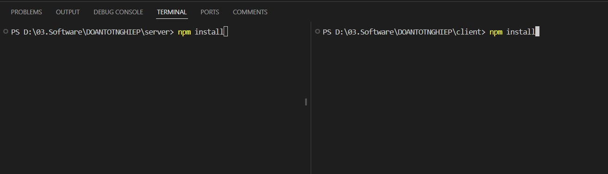

## Cách chạy project

## Bước 1:

- Tải xampp link: https://www.apachefriends.org/download.html
- Sau khi tải xong: create database name: "data_phongtro"
  

## Bước 2: clone project

- git clone https://github.com/dongoc3520/DATN_LE.git

## Bước 3: mở project với vscode

- Chia thành 2 terminal 1 bên là server 1 bên là client
- Thực hiện npm install ở cả 2 bên server và client
  

## Bước 4: chạy cả server và client: npm start

